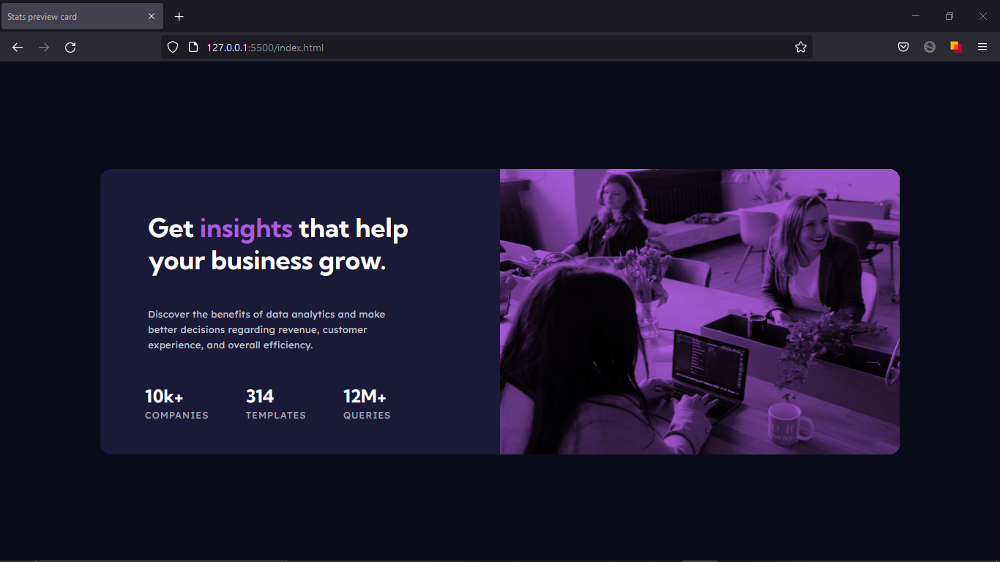
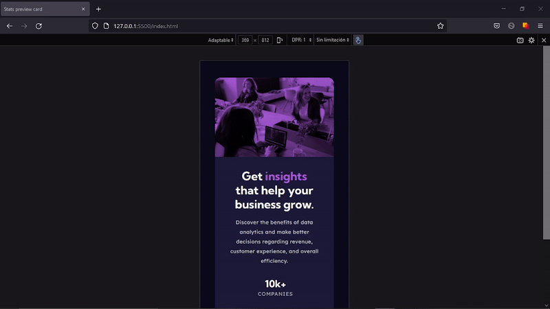

# Stats preview card component solution

Solucion al desafio [Stats preview card component challenge on Frontend Mentor](https://www.frontendmentor.io/challenges/stats-preview-card-component-8JqbgoU62). 

## Contenido

- [Stats preview card component solution](#stats-preview-card-component-solution)
  - [Contenido](#contenido)
  - [Informacion general](#informacion-general)
    - [Desafio](#desafio)
    - [Screenshot](#screenshot)
    - [Links](#links)
    - [Hecho con](#hecho-con)
  - [Autor](#autor)

## Informacion general

### Desafio

Los usuarios deben ser capaces de:

- Ver el diseño óptimo según el tamaño de pantalla de su dispositivo

### Screenshot

### Links

- Solutcion URL : [Add solution URL here](https://your-solution-url.com)
- URL del sitio : [Add live site URL here](https://your-live-site-url.com)

### Hecho con

- HTML5 
- CSS , SASS
- Flexbox
- Mobile-first workflow

## Autor

- Website - [Nicolas Gula](https://www.your-site.com)
- Twitter - [@nicolas_gula](https://twitter.com/nicolas_gula)

